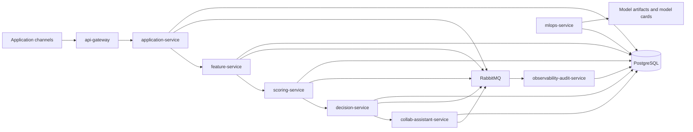
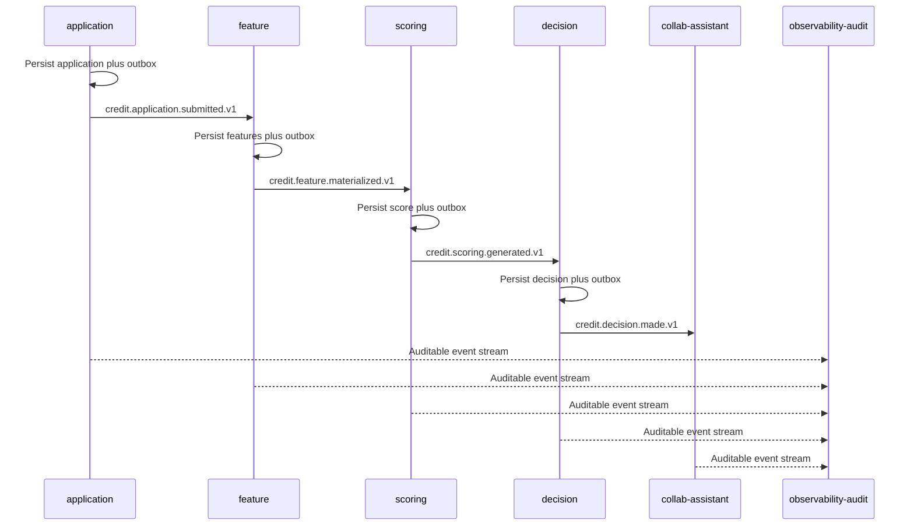

# credit-ai-ops-platform

AI operations platform for credit risk in regulated banking contexts, focused on reliability, traceability, and production-grade delivery.

**Language:** [Versión en Español](README.md) · English (primary in this file)

## Executive Summary
`credit-ai-ops-platform` demonstrates a full AI credit lifecycle:

- application intake
- feature materialization
- deterministic scoring
- explainable decisioning
- auditable event trail
- reproducible MLOps governance

Primary business value:

- faster credit decisions with controlled operational risk
- recovery-first async architecture under failure
- continuous security evidence through automated gates
- reproducible artifacts for technical and executive review

## One-Command Demonstration
```bash
make recruiter-demo
```

Expected output:

- technical executive report in `build/recruiter-demo-report.md`
- reproducible MLOps evidence in `build/recruiter-ml-evidence.json`
- reviewer scorecard in `build/reviewer-scorecard.md`
- cybersecurity, relay-only integration validation, and real HTTP gateway end-to-end validation

Final pre-share command:

```bash
make release-ready
```

## System Architecture


## Async Credit Chain


## Executive Review Questions
| Business question | Verifiable evidence |
|---|---|
| Is there end-to-end operational impact? | Relay-only async chain in `tests/integration/test_async_credit_chain.py` plus real HTTP path in `tests/e2e/test_gateway_http_stack.py` |
| Is operational risk controlled? | Typed errors, trace IDs, and runbooks in `docs/runbooks/*` |
| Is the platform audit-ready? | Redacted audit events and trace queries in `services/observability-audit` |
| Can failures be recovered safely? | Timeouts, retries, circuit-breaker, bulkhead, DLQ/replay |
| Is ML governance production-ready? | `train/evaluate/register/promote` plus model cards and reproducibility metadata |

## Service Topology
- Tier A full services: `api-gateway`, `application`, `feature`, `scoring`, `decision`
- Tier B scoped-real services: `collab-assistant`, `mlops`, `observability-audit`
- Identity: OIDC integration with Keycloak (`services/identity`)

## Implemented v1 Endpoints
- `POST /v1/gateway/credit-evaluate`
- `POST /v1/applications/intake`
- `POST /v1/features/materialize`
- `POST /v1/scores/predict`
- `POST /v1/decisions/evaluate`
- `POST /v1/assistant/summarize`
- `GET /v1/assistant/summaries/{application_id}`
- `POST /v1/mlops/train`
- `POST /v1/mlops/evaluate`
- `POST /v1/mlops/register`
- `POST /v1/mlops/promote`
- `GET /v1/mlops/runs/{run_id}`
- `POST /v1/audit/events`
- `GET /v1/audit/events`
- `GET /v1/audit/events/{event_id}`
- `GET /v1/audit/traces/{trace_id}`

Canonical contracts:

- REST: `schemas/openapi/*.yaml`
- Events: `schemas/asyncapi/credit-events-v1.yaml`
- Base schemas: `schemas/jsonschema/*.json`

Authentication:

- all `/v1/*` endpoints require `Authorization: Bearer <token>`
- `health`, `ready`, and `metrics` remain unauthenticated for local operations and probes

## Critical Technical Controls
### Reliability
- mandatory external-call timeouts
- bounded retries with backoff and jitter
- circuit-breaker and bulkhead isolation
- idempotency for external writes
- outbox/inbox plus DLQ/replay resilience

### Observability
- JSON structured logs
- propagated trace/correlation IDs
- health/readiness/metrics endpoints
- fail-loud typed error taxonomy

### Security and Supply Chain
- pinned dependencies in `requirements/lock/*.lock`
- CI SBOM generation
- image signing with Cosign plus digest pinning
- bank-grade local gate: `make bank-cybersec-gate`

## v1 SLO Baselines
- gateway API p95 `<= 300ms`
- async processing p95 `<= 2s`
- 5xx error rate `< 1%` in rolling 15-minute windows

These are operating targets. The repo does not freeze latency snapshots in markdown because
they stop being trustworthy outside the exact environment where they were collected.
Current evidence should be regenerated with `make recruiter-demo` and fresh networked runs
before quoting numbers externally.

## Local Setup (Pinned Python 3.11)
```bash
brew install python@3.11
./scripts/dev/bootstrap.sh
source .venv/bin/activate
python --version
```

Allowed runtime for v1: `>=3.11,<3.12`.

## Key Guides
- Executive brief: `docs/executive/brief.en.md`
- Role-alignment matrix: `docs/executive/role-alignment.en.md`
- Recruiter demo runbook: `docs/runbooks/recruiter-demo.md`
- Async flow runbook: `docs/runbooks/async-flow.md`
- MLOps lifecycle runbook: `docs/runbooks/mlops-lifecycle.md`
- Cybersecurity runbook: `docs/runbooks/cybersecurity.md`
