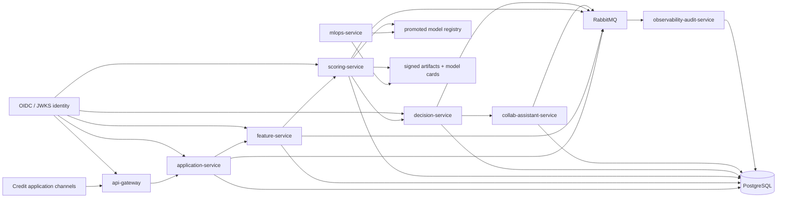
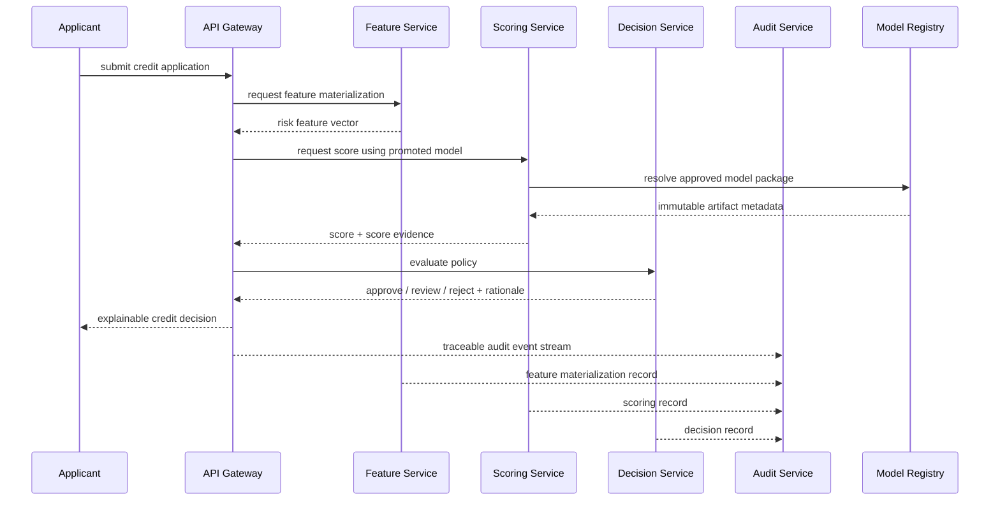
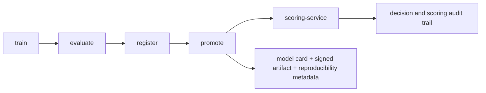

# credit-ai-ops-platform

AI credit decisioning platform for regulated environments, built around the harder parts of production: model governance, decision traceability, recovery under asynchronous failure, and security controls that exist in code instead of presentation decks.

**Language:** English (primary) | [Resumen en Espanol](README.es.md)

## Abstract

`credit-ai-ops-platform` treats credit decisioning as a governed systems problem rather than a model-serving demo.

The system accepts an application, materializes risk features, resolves the promoted model, produces a score, applies a credit policy, and records the entire path as reconstructable operational evidence. The surrounding platform is part of the product: promotion controls, signed artifacts, audit trails, replay paths, contract publication, and reproducible reviewer gates are not side notes here. They are the reason the repository is credible.

## System Thesis

The central claim of this repository is narrow and testable:

> A credit decisioning platform can move quickly without becoming operationally unverifiable, provided that model lifecycle, runtime policy, and failure recovery are treated as first-class system boundaries.

That claim is exercised through two real runtime paths:

- a synchronous gateway path for immediate credit evaluation
- an asynchronous event chain for durable processing, audit propagation, replay, and operational recovery

## At A Glance

| Dimension | Current position |
| --- | --- |
| Primary workload | Credit application intake, feature materialization, scoring, decisioning, audit, and MLOps promotion |
| Runtime shape | Multi-service Python platform with synchronous HTTP edges and asynchronous event propagation |
| Persistence posture | Historical persistence where reconstruction matters, append-only patterns where auditability matters |
| Resilience posture | Timeout, retry, circuit breaker, bulkhead, outbox relay, DLQ, replay, idempotency |
| Security posture | JWT/JWKS auth, Azure-oriented secret handling, supply-chain gates, signed model artifacts |
| Reviewer proof path | `make recruiter-demo` then `make release-ready` |

## Runtime Topology



## Decision Path



## MLOps Control Loop



## What Is Actually Real

- The synchronous gateway path is not a facade over in-process function calls. It calls the real feature, scoring, and decision services.
- The asynchronous chain is not decorative documentation. The relay-only path is exercised through integration tests and recruiter-demo receipts.
- The scoring path does not claim a magical live model registry. It resolves a promoted model package with verifiable metadata and signature checks.
- Auditability is not reduced to log lines. The system keeps reconstructable events tied to trace and correlation identifiers.
- The repo does not sell static security promises. It carries concrete gates for secret scanning, dependency posture, SBOM, and container policy.

## Operating Invariants

### Credit decision invariants

- Every decision must be explainable in terms of features, score, and policy output.
- The scoring path must resolve the approved model package, not a mutable local default.
- A replay must not silently duplicate durable records or corrupt business history.

### Platform invariants

- External calls run with bounded time.
- Integration failure must degrade explicitly, not disappear.
- Asynchronous publication must happen through relay-controlled persistence, not direct fire-and-forget side effects.
- Operational evidence must survive the happy path.

### Governance invariants

- Model lifecycle transitions are explicit: train, evaluate, register, promote.
- Artifact identity is stable: version, digest, signature, and metadata travel together.
- Reviewer evidence must be reproducible from commands, not screenshots.

## Public Surface

### Synchronous evaluation

- `POST /v1/gateway/credit-evaluate`

### Domain services

- `POST /v1/applications/intake`
- `POST /v1/features/materialize`
- `POST /v1/scores/predict`
- `POST /v1/decisions/evaluate`
- `POST /v1/assistant/summarize`
- `GET /v1/assistant/summaries/{application_id}`

### Model lifecycle

- `POST /v1/mlops/train`
- `POST /v1/mlops/evaluate`
- `POST /v1/mlops/register`
- `POST /v1/mlops/promote`
- `GET /v1/mlops/runs/{run_id}`

### Audit surface

- `POST /v1/audit/events`
- `GET /v1/audit/events`
- `GET /v1/audit/events/{event_id}`
- `GET /v1/audit/traces/{trace_id}`

Canonical contracts:

- REST: `schemas/openapi/*.yaml`
- events: `schemas/asyncapi/credit-events-v1.yaml`
- data contracts: `schemas/jsonschema/*.json`

## Evidence Surface

| Claim | Primary proof |
| --- | --- |
| The async credit chain is real | `tests/integration/test_async_credit_chain.py` |
| The gateway path reaches real services | `tests/e2e/test_gateway_http_stack.py` |
| Model lifecycle is reproducible | `docs/runbooks/mlops-lifecycle.md` and `build/recruiter-ml-evidence.json` |
| Security posture is enforced, not narrated | `make bank-cybersec-gate` |
| Documentation maps to fresh runtime evidence | `make recruiter-demo` and `build/reviewer-scorecard.md` |

## Reviewer Path

```bash
make recruiter-demo
make release-ready
```

What those commands should leave behind:

- `build/recruiter-demo-report.md`
- `build/recruiter-ml-evidence.json`
- `build/reviewer-scorecard.md`
- fresh receipts for gateway, async-chain, cybersecurity, and MLOps evidence

## Repository Guide

### Core documents

- [Executive brief](docs/executive/brief.en.md)
- [Role-alignment matrix](docs/executive/role-alignment.en.md)
- [Async flow runbook](docs/runbooks/async-flow.md)
- [MLOps lifecycle runbook](docs/runbooks/mlops-lifecycle.md)
- [Cybersecurity runbook](docs/runbooks/cybersecurity.md)
- [Audit reporting runbook](docs/runbooks/audit-reporting.md)

### Architecture references

- [Service boundaries ADR](docs/adr/0001-service-boundaries.md)
- [Event schema versioning ADR](docs/adr/0002-event-schema-versioning.md)
- [Retry and idempotency ADR](docs/adr/0003-retry-idempotency-strategy.md)
- [Model promotion ADR](docs/adr/0004-model-promotion-strategy.md)
- [Azure deployment ADR](docs/adr/0005-azure-deployment-decisions.md)

### Executive and reviewer support

- [Executive brief in Spanish](docs/executive/brief.md)
- [Role-alignment matrix in Spanish](docs/executive/role-alignment.md)
- [Spanish README companion](README.es.md)

## Local Setup

Pinned runtime for v1:

- Python `>=3.11,<3.12`

Bootstrap:

```bash
brew install python@3.11
./scripts/dev/bootstrap.sh
source .venv/bin/activate
python --version
```

## Non-Claims

- This repository does not claim a bank production deployment.
- It does not claim regulator approval, production SLO attainment, or managed-cloud disaster recovery proof.
- It does not claim that every supporting service has equal operational weight; some services are intentionally narrower than the core credit path.
- It does claim that the main runtime path, model lifecycle, and operational proof surface are strong enough to survive technical review without hand-waving.
